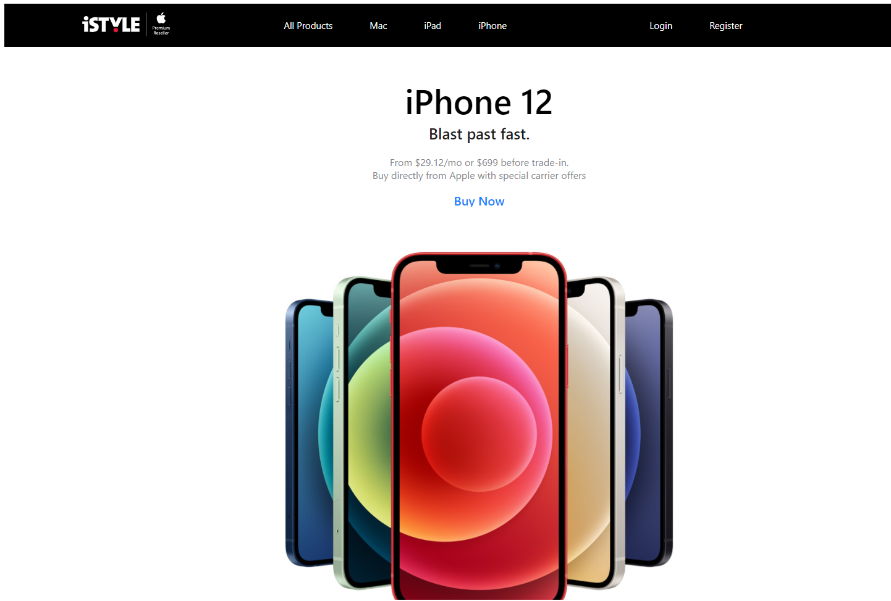

# iStore




A simple full stack e-commerce application.  

## Technology stack
* React
* react-router
* create-react-app
* NodeJS
* MongoDB

## Initialize

#### `npm install` at root level
#### `npm install` at ./server level

#### `npm start` at root level
#### `npm start` at ./server level

The application should be running afterwards

# Application description
Application is made by the typical 'react-way' where everything is splitted into big components and those big components are splitted into smaller components etc. 
Using a single global Context to keep the most needed information there.
Using external utils functions which keep information about different small parts of the app and makes adding new features easier.


## Components description
Components architecture is simply splitted into pages **(admin, auth, cart, home, products)** where components there are only beeing used at the same level.
**Global** directory holds all of the layout, styling, logic components which are used across all other components. The idea is each page components doesn't know about other components ex.(admin doesn't know about cart) and all components know about Global. 
This architecture is suitable for small projects like this one and definetely it could be improved and build in much better and scalable way.

```bash
├───admin
│   ├───create
│   ├───create-product-container
│   ├───edit
│   └───upload-img
├───auth
├───cart
│   ├───cart-summary
│   └───item-row
├───global
│   ├───auth-title
│   ├───button
│   ├───font-awesome-icon
│   ├───footer
│   ├───form
│   │   ├───form-error
│   │   ├───form-group
│   │   └───form-layout
│   ├───header
│   │   └───header-li
│   ├───link
│   ├───page-layout
│   ├───price-box
│   ├───product-nav-wrapper
│   └───special-offer
├───home
│   ├───first-home-section
│   └───second-home-section
│       ├───grid-item
│       └───grid-item-desc
└───products
    ├───grid
    ├───grid-item
    └───product-Info
```


## Other create-react-app scripts

#### `npm test`

Launches the test runner in the interactive watch mode.\
See the section about [running tests](https://facebook.github.io/create-react-app/docs/running-tests) for more information.

#### `npm run build`

Builds the app for production to the `build` folder.\
It correctly bundles React in production mode and optimizes the build for the best performance.

The build is minified and the filenames include the hashes.\
Your app is ready to be deployed!

See the section about [deployment](https://facebook.github.io/create-react-app/docs/deployment) for more information.

#### `npm run eject`

**Note: this is a one-way operation. Once you `eject`, you can’t go back!**

If you aren’t satisfied with the build tool and configuration choices, you can `eject` at any time. This command will remove the single build dependency from your project.

Instead, it will copy all the configuration files and the transitive dependencies (webpack, Babel, ESLint, etc) right into your project so you have full control over them. All of the commands except `eject` will still work, but they will point to the copied scripts so you can tweak them. At this point you’re on your own.

You don’t have to ever use `eject`. The curated feature set is suitable for small and middle deployments, and you shouldn’t feel obligated to use this feature. However we understand that this tool wouldn’t be useful if you couldn’t customize it when you are ready for it.
